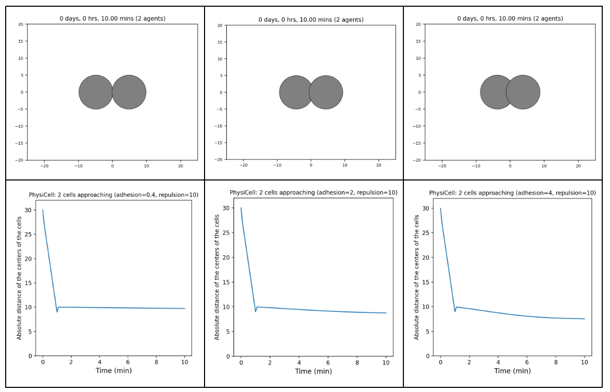

# PhysiCell results for the Community benchmarks of off-lattice multiscale modelling tools - part of the PerMedCoE project

## April 2025 updates: 

* re-do the the "2 cells approach each other, make contact, then relax" 2D model
* re-run the monolayer model and obtain the # of cells as a function of time, as well as a "Diameter / number of cells" time plot

## Build, run, analyze each model:

### 1) 2 cells coming in contact
```
make load PROJ=cells2_push
make
project
python beta/plot_t_dist.py 101
```
* the Python script generates "pc_plot_t_dist.csv" and also displays a plot (but the title is hardcoded for the params, so may not reflect the actual params if you modify the .xml)
* rename the `output` directory if you want to prevent it from being overwritten by the other model!



### 2) monolayer
```
make load PROJ=monolayer
make
project
```
